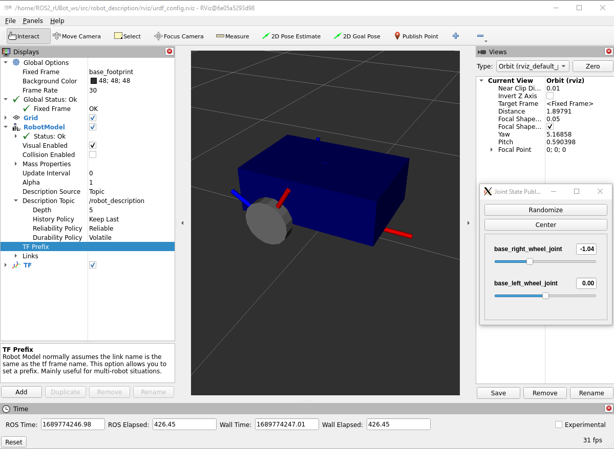
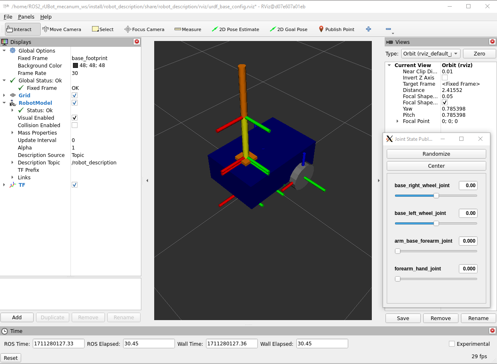
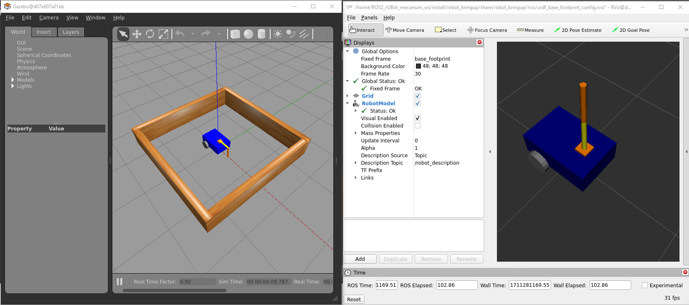

## **2. ROS2 rUBot model and Control**
The objective of this section is to simulate the rUBot behaviour in virtual environment.

The objectives of this section are:
- Create a new "robot_description" package
- Create a complete robot model
- Spawn the robot model in a proper virtual world in gazebo environment

A very good guide is deescribed in: https://www.udemy.com/course/ros2-tf-urdf-rviz-gazebo/learn/lecture/38688920#overview

### **2.1. Create a new "robot_description" package**
To create this package, type:
```shell
ros2 pkg create robot_description
```
Now proceed with the following instructions:
- remove "src" and "include" folders
- add "urdf", "meshes", "launch" and "rviz" folders
- place the robot model in urdf folder
- Install the urdf, meshes, launch and rviz folders modifying the "CMakeList.txt" file:
```shell
cmake_minimum_required(VERSION 3.8)
project(robot_description)

if(CMAKE_COMPILER_IS_GNUCXX OR CMAKE_CXX_COMPILER_ID MATCHES "Clang")
  add_compile_options(-Wall -Wextra -Wpedantic)
endif()

# find dependencies
find_package(ament_cmake REQUIRED)

install(
  DIRECTORY urdf launch rviz meshes
  DESTINATION share/${PROJECT_NAME}/
)

ament_package()
```
- Include the dependencies on package.xml file:
```xml
  <buildtool_depend>ament_cmake</buildtool_depend>

  <exec_depend>urdf</exec_depend>
  <exec_depend>xacro</exec_depend>
  <exec_depend>robot_state_publisher</exec_depend>
  <exec_depend>joint_state_publisher</exec_depend>
  <exec_depend>rviz2</exec_depend>
  <exec_depend>ros2launch</exec_depend>
  <exec_depend>gazebo_ros</exec_depend>

  <test_depend>ament_lint_auto</test_depend>
```
- move to the ws and compile again
- You can see the installed directories in "~/ROS2_rUBot_mecanum_ws/install/robot_description/share/robot_description/" folders

Now everything is ready to create the **launch file**. This can be done in python but also in xml. We will do in xml language for simplicity and better understanding.
- verify "launch" folder is created and CMakeList.txt is created properly
- create a new file "display.launch.xml" inside
- compile again
- source install/setup.bash
- Launch:
```shell
ros2 launch robot_description display.launch.xml
```
- Configure the rviz with:
    - Fixed frame to "base_footprint"
    - add "RobotModel"
    - select the robot Description topic to /robot_description
    - add TFs
- save config to rviz folder as "urdf_base_config.rviz"

> Perhaps you will have to install:
>
>sudo apt install ros-humble-joint-state-publisher-gui



The same launch file can be done in python. You can see the syntax in "display.launch,py" file in "launch" folder.
- compile the ws
- open a new terminal and type
```shell
ros2 launch robot_description display.launch.py
```
>You will see the same as before

### **2.2. Create a robot model**

A first "my_robot.urdf" file is delivered to display a first robot model in rviz program.

For a more complete robot model, it is suggested to use xacro format. This format will help you to better organize and scale your model with more functionalities.

The gazebo functionalities are defined with plugins:
- https://classic.gazebosim.org/tutorials?tut=ros_gzplugins
- https://github.com/ros-simulation/gazebo_ros_pkgs/tree/ros2/gazebo_plugins/include/gazebo_plugins

If you are using OpenCV, the frame used for the camera has a different orientation and you have to add a new link. This is explained and solved in:
- https://answers.ros.org/question/232534/gazebo-camera-frame-is-inconsistent-with-rviz-opencv-convention/

The complete "my_robot.urdf.xacro" is composed by different files:
- my_robot.urdf.xacro (the main one)
- mobile_base.xacro (with links and joints)
- common_properties.xacro (with material and inertia properties)
- mobile_base_gazebo.xacro (with differential_drive gazebo plugin)
- camera.xacro (with camera plugin)

The robot model defined in xacro format, can be displayed using the same launch files, you have only to change the name of robot model to "my_robot.urdf.xacro", in launch file:
```xml
...
<let name="urdf_path" 
     value="$(find-pkg-share robot_description)/urdf/my_robot.urdf.xacro" />
...
```



You can use also any urdf robot model. For exemple our rubot_mpuig.urdf

The only steps to do are:
- write this name in the "urdf_path"
- compile again 
- source the setup.bash


### **2.3. Create a new robot_bringup package**

This is usually made to spawn the robot model in a proper virtual world in gazebo environment.

Let's follow similar steps as previous section for robot_description package:
- Create a new package:
```shell
ros2 pkg create robot_bringup
```
- remove "src" and "include" folders
- add "launch" "rviz" "worlds" folders
- Install the folders modifying the "CMakeList.txt" file:
```shell
cmake_minimum_required(VERSION 3.8)
project(robot_bringup)

if(CMAKE_COMPILER_IS_GNUCXX OR CMAKE_CXX_COMPILER_ID MATCHES "Clang")
  add_compile_options(-Wall -Wextra -Wpedantic)
endif()

# find dependencies
find_package(ament_cmake REQUIRED)

install(
  DIRECTORY launch rviz worlds
  DESTINATION share/${PROJECT_NAME}/
)

ament_package()
```

- create a new "my_robot_gazebo.launch.xml"
```xml
<launch>
    <let name="urdf_path" 
         value="$(find-pkg-share robot_description)/urdf/my_robot.urdf.xacro" />
    <let name="rviz_config_path"
         value="$(find-pkg-share robot_bringup)/rviz/urdf_config.rviz" />

    <node pkg="robot_state_publisher" exec="robot_state_publisher">
        <param name="robot_description"
               value="$(command 'xacro $(var urdf_path)')" />
    </node>

    <include file="$(find-pkg-share gazebo_ros)/launch/gazebo.launch.py">
     <arg name="world" value="$(find-pkg-share robot_bringup)/worlds/test_world.world" />
    </include>

    <node pkg="gazebo_ros" exec="spawn_entity.py"
          args="-topic robot_description -entity my_robot" />

    <node pkg="rviz2" exec="rviz2" output="screen" 
          args="-d $(var rviz_config_path)" />
</launch>
```
- Because of we have used other packages, these have to be included in "package.xml" file:

```xml
  <buildtool_depend>ament_cmake</buildtool_depend>

  <exec_depend>robot_description</exec_depend>
  <exec_depend>robot_state_publisher</exec_depend>
  <exec_depend>joint_state_publisher</exec_depend>
  <exec_depend>rviz2</exec_depend>
  <exec_depend>ros2launch</exec_depend>
  <exec_depend>gazebo_ros</exec_depend>

  <test_depend>ament_lint_auto</test_depend>
```
- Now you can compile again
```shell
colcon build
```
You can now bringup your robot in the designed world
```shell
ros2 launch robot_bringup my_robot_gazebo.launch.xml
```




**Activity:**

Bringup your rUBot model within the real custom designed World